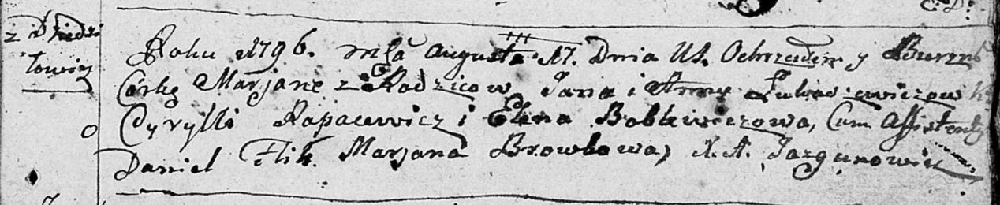

**Лукашевич Анна (Łukaszewiczowa Anna)**

8 апреля 1795 г -- крещение дочери Петрунели (НИАБ 136-13-894, лист 24,
№6/1795-р (ориг)), (РГИА 823-2-18, лист 252, №6/1795-р (коп)).

17 августа 1796 г -- крещение дочери Марьяны (НИАБ 136-13-894, лист 30,
№73/1796-р (ориг)).

**НИАБ 136-13-894:** Лист 24. **Метрическая запись №6/1795-р (ориг).**

{width="6.496527777777778in"
height="1.4831583552055994in"}

Дедиловичская Покровская церковь. 8 апреля 1795 года. Метрическая запись
о крещении.

Łukaszewiczowna Petrunela -- дочь родителей с деревни Дедиловичи.

Łukaszewicz Jan -- отец.

Łukaszewiczowa Anna -- мать.

Reje Piotr - кум.

Sołowska Anna - кума.

Rapacewicz Cyrylli - ассистент.

Jazgunowiczowna Wiktorya - ассистентка.

Jazgunowicz Antoni -- ксёндз.

**РГИА 823-2-18:** Лист 252. **Метрическая запись №6/1795-р (коп).**

{width="6.496527777777778in"
height="1.8708333333333333in"}

Дедиловичская Покровская церковь. 8 апреля 1795 года. Метрическая запись
о крещении.

Łukaszewiczowna Petronela -- дочь родителей с деревни Дедиловичи.

Łukaszewicz Jan -- отец.

Łukaszewiczowa Anna -- мать.

Rejecki Piotr -- кум.

\[Solo\]wska Anna -- кума.

Jazgunowicz Antoni -- ксёндз.

**НИАБ 136-13-894:** Лист 30. **Метрическая запись №73/1796-р (ориг).**

{width="6.496527777777778in"
height="1.3322944006999125in"}

Дедиловичская Покровская церковь. 17 августа 1796 года. Метрическая
запись о крещении.

Łukaszewiczowna Marjana -- дочь родителей с деревни Дедиловичи.

Łukaszewicz Jan -- отец.

Łukaszewiczowa Anna -- мать.

Rapacewicz Cyrylli - кум.

Boblewiczowa Elena - кума.

Flik Daniel -- ассистент.

Browkowa Marjana -- ассистент.

Jazgunowicz Antoni -- ксёндз.
