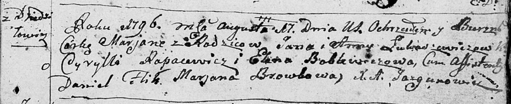

**Лукашевич Марьяна Янова (Łukaszewiczowna Marjana)**

17 августа 1796 г -- крещение (НИАБ 136-13-894, лист 30, №73/1796-р
(ориг)).

**НИАБ 136-13-894:** Лист 30. **Метрическая запись №73/1796-р (ориг).**

Дедиловичская Покровская церковь. 17 августа 1796 года. Метрическая
запись о крещении.

Łukaszewiczowna Marjana -- дочь родителей с деревни Дедиловичи.

Łukaszewicz Jan -- отец.

Łukaszewiczowa Anna -- мать.

Rapacewicz Cyrylli - кум.

Boblewiczowa Elena - кума.

Flik Daniel -- ассистент.

Browkowa Marjana -- ассистент.

Jazgunowicz Antoni -- ксёндз.
