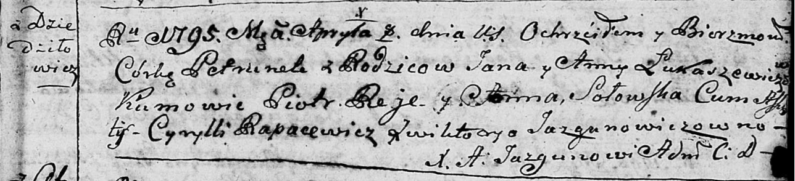
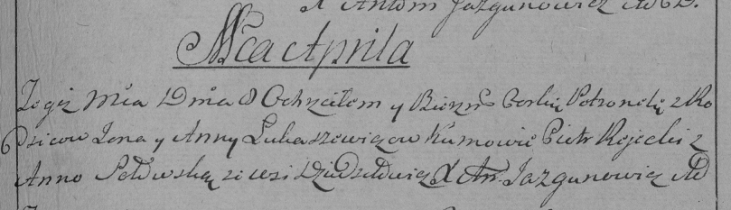

**Лукашевич Петрунеля Янова (Łukaszewiczowna Petrunela)**

8 апреля 1795 г -- крещение (НИАБ 136-13-894, лист 24, №6/1795-р
(ориг)), (РГИА 823-2-18, лист 252, №6/1795-р (коп)).

**НИАБ 136-13-894:** Лист 24. **Метрическая запись №6/1795-р (ориг).**

Дедиловичская Покровская церковь. 8 апреля 1795 года. Метрическая запись
о крещении.

Łukaszewiczowna Petrunela -- дочь родителей с деревни Дедиловичи.

Łukaszewicz Jan -- отец.

Łukaszewiczowa Anna -- мать.

Reje Piotr - кум.

Sołowska Anna - кума.

Rapacewicz Cyrylli - ассистент.

Jazgunowiczowna Wiktorya - ассистентка.

Jazgunowicz Antoni -- ксёндз.

**РГИА 823-2-18:** Лист 252. **Метрическая запись №6/1795-р (коп).**

Дедиловичская Покровская церковь. 8 апреля 1795 года. Метрическая запись
о крещении.

Łukaszewiczowna Petronela -- дочь родителей с деревни Дедиловичи.

Łukaszewicz Jan -- отец.

Łukaszewiczowa Anna -- мать.

Rejecki Piotr -- кум.

\[Solo\]wska Anna -- кума.

Jazgunowicz Antoni -- ксёндз.
