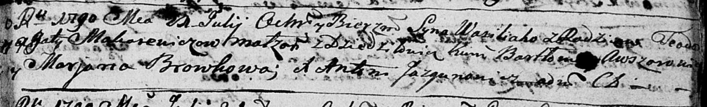

**Макаревич Василий Тодоров (Makarewicz Wasiliah)**

21 июля 1790 г -- крещение (НИАБ 136-13-894, лист 10, №43/1790-р
(ориг)).

**НИАБ 136-13-894:** Лист 10. **Метрическая запись №43/1790-р (ориг).**

Дедиловичская Покровская церковь. 21 июля 1790 года. Метрическая запись
о крещении.

Makarewicz Wasiliah -- сын родителей с деревни Дедиловичи.

Makarewicz Teodor -- отец.

Makarewiczowa Agata -- мать.

Awszowski Bartłomiey - кум.

Browkowa Marjana - кума.

Jazgunowicz Antoni -- ксёндз.
