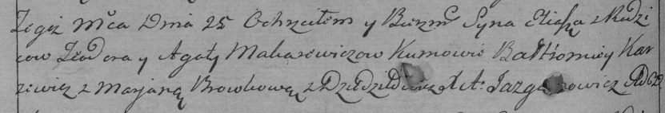

**Макаревич Тодор (Makarewicz Teodor)**

21 июля 1790 г -- крещение сына Василия (НИАБ 136-13-894, лист 10,
№43/1790-р (ориг)).

25 июля 1792 г -- крещение сына Ильи (НИАБ 136-13-894, лист 10,
№43/1790-р (ориг)), (РГИА 823-2-18, лист 244, №18/1792-р (коп)).

2 сентября 1795 г -- крещение сына Яна (НИАБ 136-13-894, лист 25,
№32/1795-р (ориг)), (РГИА 823-2-18, лист 253, №25/1795-р (коп)).

**НИАБ 136-13-894:** Лист 10. **Метрическая запись №43/1790-р (ориг).**

Дедиловичская Покровская церковь. 21 июля 1790 года. Метрическая запись
о крещении.

Makarewicz Wasiliah -- сын родителей с деревни Дедиловичи.

Makarewicz Teodor -- отец.

Makarewiczowa Agata -- мать.

Awszowski Bartłomiey - кум.

Browkowa Marjana - кума.

Jazgunowicz Antoni -- ксёндз.

**НИАБ 136-13-894:** Лист 16об. **Метрическая запись №42/1792-р
(ориг).**

Дедиловичская Покровская церковь. 25 июля 1792 года. Метрическая запись
о крещении.

Makarewicz Eliasz -- сын родителей с деревни Дедиловичи.

Makarewicz Teodor -- отец.

Makarewiczowa Agata -- мать.

Karżewicz Bałtromiey - кум.

Browkowa Marjana - кума.

Jazgunowicz Antoni -- ксёндз.

**РГИА 823-2-18:** Лист 244об. **Метрическая запись №19/1792-р (коп).**

Дедиловичская Покровская церковь. 25 июля 1792 года. Метрическая запись
о крещении.

Makarewicz Eliasz -- сын родителей с деревни Дедиловичи.

Makarewicz Teodor -- отец.

Makarewiczowa Agata -- мать.

Karżewicz Bałtromiey -- кум.

Browkowa Marjana -- кума.

Jazgunowicz Antoni -- ксёндз.

**НИАБ 136-13-894:** Лист 25. **Метрическая запись №32/1795-р (ориг).**

Дедиловичская Покровская церковь. 2 сентября 1795 года. Метрическая
запись о крещении.

Makarewicz Jan -- сын родителей с деревни Дедиловичи.

Makarewicz Teodor -- отец.

Makarewiczowa Agata -- мать.

Szyło Michal - кум.

Browkowa Wiora - кума.

Jazgunowicz Antoni -- ксёндз.

**РГИА 823-2-18:** Лист 253. **Метрическая запись №25/1795-р (коп).**

Дедиловичская Покровская церковь. 2 сентября 1795 года. Метрическая
запись о крещении.

Makarewicz Jan -- сын родителей с деревни Дедиловичи.

Makarewicz Teodor -- отец.

Makarewiczowa Agata -- мать.

Szyło Michał -- кум.

Browkowa Wiera -- кума.

Jazgunowicz Antoni -- ксёндз.
