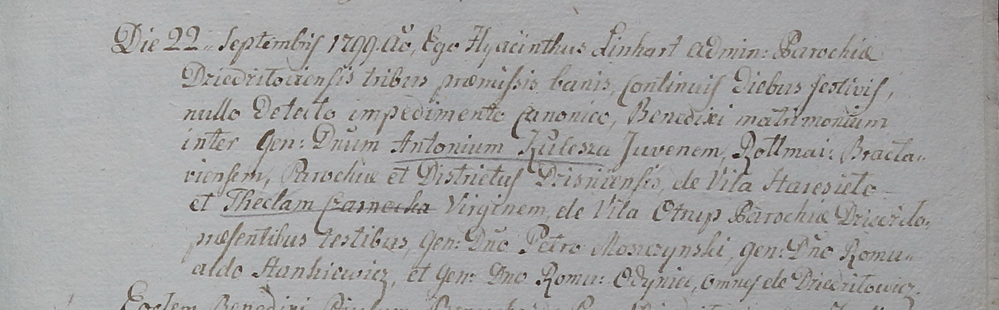
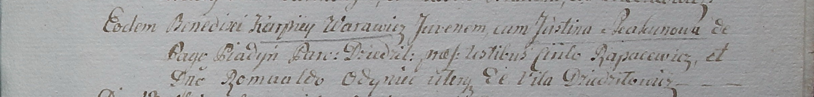

**Одынец Роман, Ромуальд, шляхтич (Odyniec Roman, Romuald)**

22 сентября 1799 г -- свидетель венчания молодого шляхтича Антония
Кулеша с села Гора Дисненской парохии с девицей шляхтянкой Теклей
Чарнецкой с деревни Отруб (НИАБ 1781-27-199, лист 130, №7/1799-б).

22 сентября 1799 г -- свидетель венчания молодого Карпа Варавича с
Юстиной Скакун с деревни Пядань (НИАБ 1781-27-199, лист 130, №9/1799-б).

**НИАБ 1781-27-199:** Лист 130. **Метрическая запись №7/1799-б.**

Дедиловичский костел Наисвятейшего Сердца Иисуса. 22 сентября 1799 года.
Метрическая запись о венчании.

Kulesz Antoni -- жених, молодой, шляхтич с парохии Дисненской, ротмистр
Браславский, с села Гора.

Czarnecka Thekla -- невеста, девица, шляхтянка с парохии Дедиловичской,
с деревни Отруб.

Moszczynski Petro -- свидетель, шляхтич, с деревни Дедиловичи.

Stankiewicz Romualdo -- свидетель, шляхтич, с деревни Дедиловичи.

Odyniec Roman -- свидетель, шляхтич, с деревни Дедиловичи.

Linhart Hyacinthus -- ксёндз.

**НИАБ 1781-27-199:** Лист 130. **Метрическая запись №9/1799-б.**

Дедиловичский костел Наисвятейшего Сердца Иисуса. 22 сентября 1799 года.
Метрическая запись о венчании.

Warawicz Karpiey -- жених, молодой.

Skakunowa Justina -- невеста, с деревни Пядань, парохии Дедиловичской.

Rapacewicz Ciriło -- свидетель.

Odyniec Romuald -- свидетель, шляхтич, с деревни Дедиловичи.

Linhart Hyacinthus -- ксёндз.
