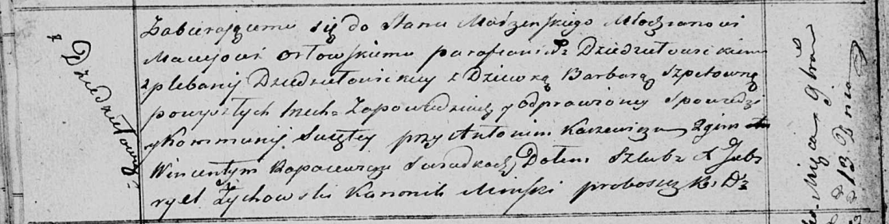

**Орловский Мацей (Orłowski Maciey)**

13 ноября 1820 г -- венчание с девкой Варварой Шпет (НИАБ 136-13-920,
лист 27об, №10/1820-б (ориг)).

**НИАБ 136-13-920:** Лист 27об. **Метрическая запись №10/1820-б
(ориг).**

{width="6.496527777777778in"
height="1.6427384076990377in"}

Осовская Покровская церковь. 13 ноября 1820 года. Запись о венчании.

Orłowski Maciey -- жених, молодой, парафии Дедиловичской католической,
плебании Дедиловичской, с деревни Дедиловичи.

Szpetowna Barbara -- невеста, девка, парафии Осовской.

Karżewicz Antoni -- свидетель.

Rapacewicz Wincenty -- свидетель.

Woyniewicz Tomasz -- ксёндз.
