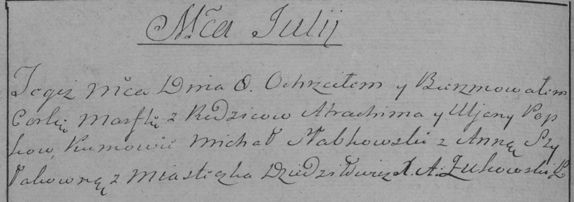
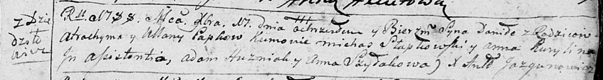
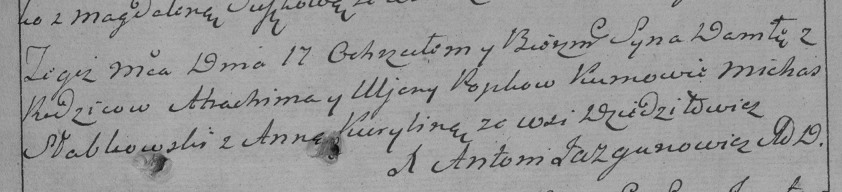
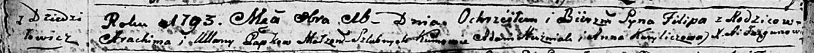
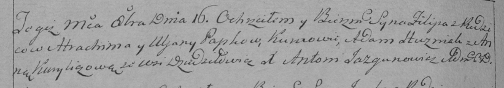

**Папко Ульяна (Papkowa, Popkowa Ullana)**

8 июля 1785 г -- крещение дочери Марфули (РГИА 823-2-18, лист 229об,
№16/1785-р (коп)).

17 декабря 1788 г -- крещение сына Данилы (НИАБ 136-13-894, лист 6,
№68/1788-р (ориг)), (РГИА 823-2-18, лист 237, №33/1788-р (коп)).

16 октября 1793 г -- крещение сына Филиппа (НИАБ 136-13-894, лист 20об,
№72/1793-р (ориг)), (РГИА 823-2-18, лист 248об, №39/1793-р (коп)).

**РГИА 823-2-18:** Лист 229об. **Метрическая запись №16/1785-р (коп).**

Дедиловичская Покровская церковь. 8 июля 1785 года. Метрическая запись о
крещении.

Popkowna Marfula -- дочь родителей с местечка Дедиловичи.

Popko Atrachim -- отец.

Popkowa Uljana -- мать.

Słabkowski Michał -- кум.

Szyłakowna Anna - кума.

Żukowski A. -- ксёндз.

**НИАБ 136-13-894:** Лист 6. **Метрическая запись №68/1788-р (ориг).**

Дедиловичская Покровская церковь. 17 декабря 1788 года. Метрическая
запись о крещении.

Papko Daniła -- сын родителей с деревни Дедиловичи.

Papko Atrochim -- отец.

Papkowa Ullana -- мать.

Słapkowski Michaś - кум.

Kurylina Anna - кума.

Huzniak Adam --ассистент.

Szyłakowa Anna-- ассистент.

Jazgunowicz Antoni -- ксёндз.

**РГИА 823-2-18:** Лист 237. **Метрическая запись №33/1788-р (коп).**

Дедиловичская Покровская церковь. 17 декабря 1788 года. Метрическая
запись о крещении.

Popko Daniło -- сын родителей с деревни Дедиловичи.

Popko Atrachim -- отец.

Popkowa Uljana -- мать.

Słabkowski Michas -- кум.

Kurylina Anna - кума.

Jazgunowicz Antoni -- ксёндз.

Лист 20-об. **Метрическая запись №72/1793-р (ориг).**

Дедиловичская Покровская церковь. 16 октября 1793 года. Метрическая
запись о крещении.

Papko Filip -- сын родителей с деревни Дедиловичи.

Papko Atrоchim -- отец.

Papkowa Ullana-- мать.

Huzniak Adam - кум.

Kuryliczowa Anna - кума.

Jazgunowicz Antoni -- ксёндз.

**РГИА 823-2-18:** Лист 248об. **Метрическая запись №39/1793-р (коп).**

Дедиловичская Покровская церковь. 16 октября 1793 года. Метрическая
запись о крещении.

Papko Filip -- сын родителей с деревни Дедиловичи.

Papko Atrachim -- отец.

Papkowa Uljana -- мать.

Huzniak Adam -- кум.

Kuryliczowa Anna -- кума.

Jazgunowicz Antoni -- ксёндз.
