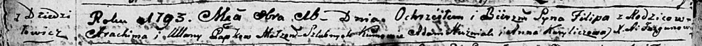

**Папко Филип Атрохимов (Papko Filip)**

16 октября 1793 г -- крещение (НИАБ 136-13-894, лист 20об, №72/1793-р
(ориг)), (РГИА 823-2-18, лист 248об, №39/1793-р (коп)).

Лист 20-об. **Метрическая запись №72/1793-р (ориг).**

{width="6.496527777777778in"
height="0.43113517060367457in"}

Дедиловичская Покровская церковь. 16 октября 1793 года. Метрическая
запись о крещении.

Papko Filip -- сын родителей с деревни Дедиловичи.

Papko Atrоchim -- отец.

Papkowa Ullana-- мать.

Huzniak Adam - кум.

Kuryliczowa Anna - кума.

Jazgunowicz Antoni -- ксёндз.

**РГИА 823-2-18:** Лист 248об. **Метрическая запись №39/1793-р (коп).**

{width="6.496527777777778in"
height="1.1395833333333334in"}

Дедиловичская Покровская церковь. 16 октября 1793 года. Метрическая
запись о крещении.

Papko Filip -- сын родителей с деревни Дедиловичи.

Papko Atrachim -- отец.

Papkowa Uljana -- мать.

Huzniak Adam -- кум.

Kuryliczowa Anna -- кума.

Jazgunowicz Antoni -- ксёндз.
