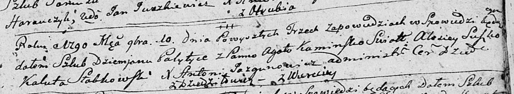
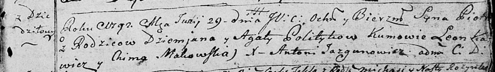
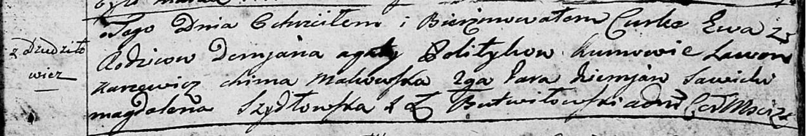
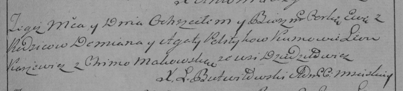
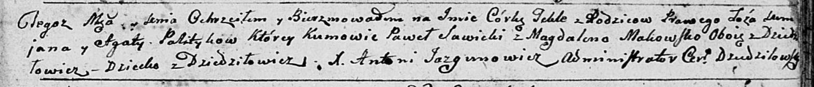
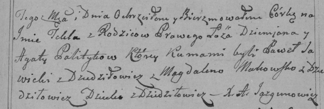

**Политыка Демьян (Polityka Dziemjan)**

10 ноября 1790 г -- венчание с Агатой Каминской с деревни Веретей (НИАБ
136-13-894, лист 69, №16/1790-б (ориг)).

29 июня 1792 г -- крещение сына Петра (НИАБ 136-13-894, лист 16,
№37/1792-р (ориг)).

13 мая 1795 г -- крещение дочери Зофии (НИАБ 136-13-894, лист 24,
№12/1795-р (ориг)).

10 февраля 1796 г -- свидетель венчания Алеся Каминского с деревни
Веретей с девкой Ксеней Бусло с деревни Дедиловичи (НИАБ 136-13-920,
лист 3, №6/1796-б (ориг)).

8 февраля 1797 г -- крещение дочери Евы (НИАБ 136-13-894, лист 32,
№12/1797-р (ориг)), (РГИА 823-2-18, лист 259, №11/1797-р (коп)).

9 ноября 1799 г -- крещение дочери Текли (НИАБ 136-13-894, лист 40,
№46/1799-р (ориг)), (РГИА 823-2-18, лист 273, №45/1799-р (коп)).

**НИАБ 136-13-894:** Лист 69. **Метрическая запись №16/1790-б (ориг).**

Дедиловичская Покровская церковь. 10 ноября 1790 года. Метрическая
запись о венчании.

Palytyka Dziemjan -- жених, с деревни Дедиловичи.

Kaminska Agata -- невеста, с деревни Веретей.

Suszko Alisiey -- свидетель.

Słabkowski Kaluta -- свидетель.

Jazgunowicz Antoni -- ксёндз.

**НИАБ 136-13-894:** Лист 16. **Метрическая запись №37/1792-р (ориг).**

Дедиловичская Покровская церковь. 29 июня 1792 года. Метрическая запись
о крещении.

Polityka Piotr -- сын родителей с деревни Дедиловичи.

Polityka Dziemjan -- отец.

Politykowa Agata -- мать.

Karżewicz Leon - кум.

Makowska Chima - кума.

Jazgunowicz Antoni -- ксёндз.

**НИАБ 136-13-894:** Лист 24. **Метрическая запись №12/1795-р (ориг).**

Дедиловичская Покровская церковь. 13 мая 1795 года. Метрическая запись о
крещении.

Politykowna Zofija -- дочь родителей с деревни Дедиловичи.

Polityko Dziemjan -- отец.

Politykowa Agata -- мать.

Karżewicz Leon - кум.

Makowska Chyma - кума.

Jazgunowicz Antoni -- ксёндз.

**НИАБ 136-13-920:** Лист 3. **Метрическая запись №6/1796-б (ориг).**

Дедиловичская Покровская церковь. 10 февраля 1796 года. Метрическая
запись о венчании.

Kaminski Aleś -- жених, деревня Веретей.

Busłowa Xienia -- невеста, девка, деревня Дедиловичи.

Polityka Dziemjan -- свидетель, деревня Дедиловичи.

Bautruk Leon -- свидетель, деревня Нивки.

Jazgunowicz Antoni -- ксёндз.

**НИАБ 136-13-894:** Лист 32. **Метрическая запись №12/1797-р (ориг).**

Дедиловичская Покровская церковь. 8 февраля 1797 года. Метрическая
запись о крещении.

Politykowna Ewa -- дочь родителей с деревни Дедиловичи.

Polityko Demjan -- отец.

Politykowa Agata -- мать.

Karżewicz Leon - кум.

Makowska Chima - кума.

Sawicki Diemjan - ассистент.

Szydłowska Magdalena - ассистентка.

Butwilowski Lukasz -- ксёндз Мстижской церкви.

**РГИА 823-2-18:** Лист 259. **Метрическая запись №11/1797-р (коп).**

Дедиловичская Покровская церковь. 8 февраля 1797 года. Метрическая
запись о крещении.

Politykowna Ewa -- дочь родителей с деревни Дедиловичи.

Polityko Demian -- отец.

Politykowa Agata -- мать.

Karżewicz Leon -- кум.

Makowska Chima -- кума.

Jazgunowicz Antoni -- ксёндз.

**НИАБ 136-13-894:** Лист 40. **Метрическая запись №46/1799-р (ориг).**

Дедиловичская Покровская церковь. 9 ноября 1799 года. Метрическая запись
о крещении.

Politykowna Tekla -- дочь родителей с деревни Дедиловичи.

Polityko Demjan -- отец.

Politykowa Agata -- мать.

Sawicki Paweł -- кум, с деревни Дедиловичи.

Makowska Magdalena -- кума, с деревни Дедиловичи.

Jazgunowicz Antoni -- ксёндз.

**РГИА 823-2-18:** Лист 273. **Метрическая запись №45/1799-р (коп).**

Дедиловичская Покровская церковь. \[9\] ноября 1799 года. Метрическая
запись о крещении.

Palitykowna Tekla -- дочь родителей с деревни Дедиловичи.

Palityka Dziemjan -- отец.

Palitykowa Agata -- мать.

Sawicki Paweł -- кум, с деревни Дедиловичи.

Makowska Magdalena -- кума, с деревни Дедиловичи.

Jazgunowicz Antoni -- ксёндз.
