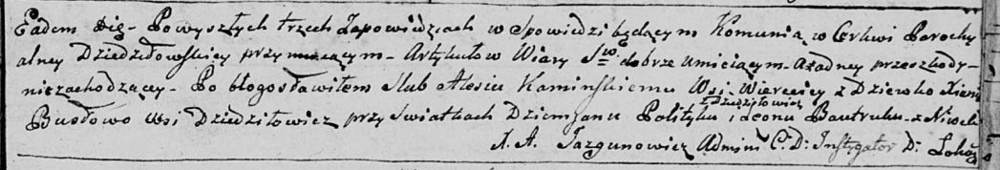

**Политыко Зофия Демьянова (Politykowna Zofija)**

13 мая 1795 г -- крещение (НИАБ 136-13-894, лист 24, №12/1795-р (ориг)).

**НИАБ 136-13-894:** Лист 24. **Метрическая запись №12/1795-р (ориг).**

{width="6.496527777777778in"
height="0.7073829833770778in"}

Дедиловичская Покровская церковь. 13 мая 1795 года. Метрическая запись о
крещении.

Politykowna Zofija -- дочь родителей с деревни Дедиловичи.

Polityko Dziemjan -- отец.

Politykowa Agata -- мать.

Karżewicz Leon - кум.

Makowska Chyma - кума.

Jazgunowicz Antoni -- ксёндз.
