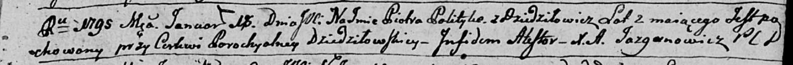

**Политыко Пётр Демьянов (Polityka Piotr)**

29 июня 1792 г -- крещение (НИАБ 136-13-894, лист 16, №37/1792-р
(ориг)).

18 января 1795 г -- отпевание, умер в возрасте 2 года (НИАБ 136-13-919,
лист 4, №3/1795-у (ориг)).

**НИАБ 136-13-894:** Лист 16. **Метрическая запись №37/1792-р (ориг).**

{width="6.496527777777778in"
height="0.9561406386701662in"}

Дедиловичская Покровская церковь. 29 июня 1792 года. Метрическая запись
о крещении.

Polityka Piotr -- сын родителей с деревни Дедиловичи.

Polityka Dziemjan -- отец.

Politykowa Agata -- мать.

Karżewicz Leon - кум.

Makowska Chima - кума.

Jazgunowicz Antoni -- ксёндз.

**НИАБ 136-13-919:** Лист 4. **Метрическая запись №3/1795-у (ориг).**

{width="6.496527777777778in"
height="0.5354166666666667in"}

Дедиловичская Покровская церковь. 18 января 1795 года. Метрическая
запись об отпевании.

Polityko Piotr -- умерший, 2 года, с деревни Дедиловичи, похоронен на
кладбище при церкви Дедиловичской.

Jazgunowicz Antoni -- ксёндз.
