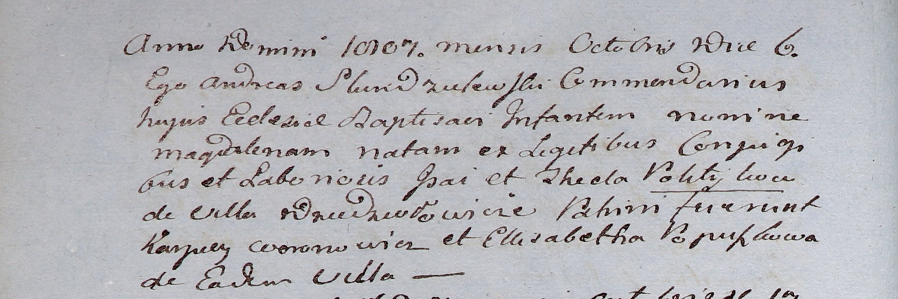

**Политыка Магдалена Исаева (Politykowna Magdalena)**

6 октября 1807 г -- крещение (НИАБ 937-4-32, лист 16об, №19/1807-р).

**НИАБ 937-4-32:** Лист 16об. **Метрическая запись №19/1807-р.**

Дедиловичский костел Наисвятейшего Сердца Иисуса. 6 октября 1807 года.
Метрическая запись о крещении.

Politykowna Magdalena -- дочь крестьян с деревни Дедиловичи.

Polityka Jsai -- отец.

Politykowa Thecla -- мать.

Woronowicz Karpiey -- крестный отец.

Popuszkowa Elisabetha -- крестная мать, с деревни Дедиловичи.

Scindzelewski Andreas -- ксёндз, викарий Дедиловичский.
