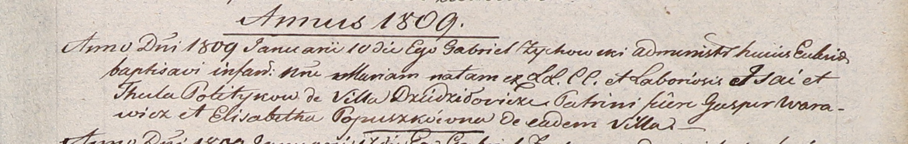

**Политыка Мария Исаева (Politykowna Maria)**

10 января 1809 г -- крещение (НИАБ 937-4-32, лист 19, №1/1809-р).

**НИАБ 937-4-32:** Лист 19. **Метрическая запись №1/1809-р.**

Дедиловичский костел Наисвятейшего Сердца Иисуса. 10 января 1809 года.
Метрическая запись о крещении.

Politykowna Maria -- дочь крестьян с деревни Дедиловичи.

Polityko Jsai -- отец.

Politykowa Thecla -- мать.

Warawicz Gasper -- крестный отец.

Popuszkowna Elisabetha -- крестная мать, с деревни Дедиловичи.

Zychowski Gabriel -- ксёндз.
