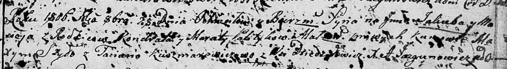

**Политыка Кондрат (Polityka Kondrat)**

12 ноября 1803 г -- крещение сына Винцента Викторыя (НИАБ 136-13-894,
лист 52, №45/1803-р (ориг)).

28 октября 1806 г -- крещение сына Якуба Мацея (НИАБ 136-13-894, лист
61, №47/1806-р (ориг)).

**НИАБ 136-13-894:** Лист 52. **Метрическая запись №45/1803-р (ориг).**

{width="6.496527777777778in"
height="1.9223392388451443in"}

Дедиловичская Покровская церковь. 12 ноября 1803 года. Метрическая
запись о крещении.

Polityko Wincenty Wiktory -- сын родителей с деревни Дедиловичи.

Polityko Kondrat -- отец.

Politykowa Marcelija -- мать.

Szyło Maxim -- кум.

Karżewiczowa Taciana -- кума.

Jazgunowicz Antoni -- ксёндз.

**НИАБ 136-13-894:** Лист 61. **Метрическая запись №47/1806-р (ориг).**

{width="6.496527777777778in"
height="0.8924431321084865in"}

Дедиловичская Покровская церковь. 28 октября 1806 года. Метрическая
запись о крещении.

Palityko Jakub Maciey -- сын родителей с деревни Дедиловичи.

Palityko Kandrat -- отец.

Palitykowa Maruta -- мать.

Szyło Maxym -- кум.

Kuszniarewiczowa Taciana -- кума.

Jazgunowicz Antoni -- ксёндз.
