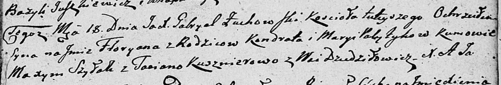

**Политыка Кондрат (Polityka Kondrat)**

18 июля 1809 г -- крещение сына Флорыана (НИАБ 136-13-894, лист 75,
№35/1809-р (ориг)).

**НИАБ 136-13-894:** Лист 75. **Метрическая запись №35/1809-р (ориг).**

{width="6.496527777777778in"
height="1.1150503062117236in"}

Дедиловичская Покровская церковь. 18 июля 1809 года. Метрическая запись
о крещении.

Polityka Fłoryan -- сын родителей с деревни Дедиловичи.

Polityka Kondrat -- отец.

Politykowa Marya -- мать.

Szyłak Maxym -- кум.

Kusznierowa Taciana -- кума.

Zuchowski Gabryel -- ксёндз.
