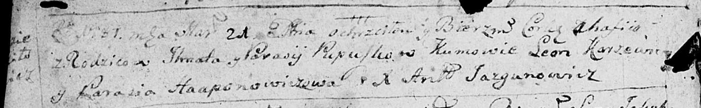
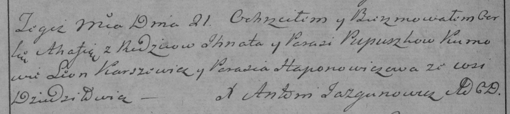

**Пупушко Агафия Игнатова (Pupuszkowna Ahafija)**

21 марта 1787 г -- крещение дочери Агафии (НИАБ 136-13-894, лист 1об,
№9/1787-р (ориг)), (РГИА 823-18, лист 233об, №8/1787-р (коп)).

**НИАБ 136-13-894:** Лист 1об. **Метрическая запись №9/1787-р (ориг).**

Дедиловичская Покровская церковь. 21 марта 1787 года. Метрическая запись
о крещении.

Pupuszkowna Ahafiia -- дочь родителей с деревни Дедиловичи.

Pupuszko Jhnat -- отец.

Pupuszkowa Parasija -- мать.

Karżewicz Leon - кум.

Haponowiczowa Parasia - кума.

Jazgunowicz Antoniusz -- ксёндз.

**РГИА 823-2-18:** Лист 233об. **Метрическая запись №8/1787-р (коп).**

Дедиловичская Покровская церковь. 21 марта 1787 года. Метрическая запись
о крещении.

Pupuszkowna Ahafia -- дочь родителей с деревни Дедиловичи.

Pupuszko Jhnat -- отец.

Pupuszkowa Parasia -- мать.

Karżewicz Leon -- кум.

Hapanowiczowa Parasia - кума.

Jazgunowicz Antoni -- ксёндз.
