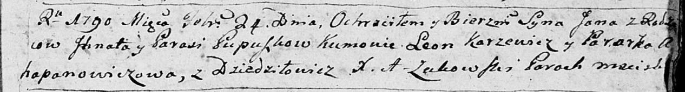

**Пупушко Игнат (Pupuszko Jhnat)**

21 марта 1787 г -- крещение дочери Агафии (НИАБ 136-13-894, лист 1об,
№9/1787-р (ориг)), (РГИА 823-18, лист 233об, №8/1787-р (коп)).

24 февраля 1790 г -- крещение сына Яна (НИАБ 136-13-894, лист 9,
№15/1790-р (ориг)), (РГИА 823-2-18, лист 239об, №8/1790-р (коп)).

16 января 1793 г -- крещение дочери Магдалены (НИАБ 136-13-894, лист 18,
№9/1793-р (ориг)).

6 октября 1795 г -- крещение дочери Паланеи (НИАБ 136-13-894, лист 25об,
№41/1795-р (ориг)), (РГИА 823-2-18, лист 253об, №33/1795-р (коп)).

**НИАБ 136-13-894:** Лист 1об. **Метрическая запись №9/1787-р (ориг).**

{width="6.496527777777778in"
height="1.0017355643044619in"}

Дедиловичская Покровская церковь. 21 марта 1787 года. Метрическая запись
о крещении.

Pupuszkowna Ahafiia -- дочь родителей с деревни Дедиловичи.

Pupuszko Jhnat -- отец.

Pupuszkowa Parasija -- мать.

Karżewicz Leon - кум.

Haponowiczowa Parasia - кума.

Jazgunowicz Antoniusz -- ксёндз.

**РГИА 823-2-18:** Лист 233об. **Метрическая запись №8/1787-р (коп).**

{width="6.496527777777778in"
height="1.4604166666666667in"}

Дедиловичская Покровская церковь. 21 марта 1787 года. Метрическая запись
о крещении.

Pupuszkowna Ahafia -- дочь родителей с деревни Дедиловичи.

Pupuszko Jhnat -- отец.

Pupuszkowa Parasia -- мать.

Karżewicz Leon -- кум.

Hapanowiczowa Parasia - кума.

Jazgunowicz Antoni -- ксёндз.

**НИАБ 136-13-894:** Лист 9. **Метрическая запись №15/1790-р (ориг).**

{width="6.496527777777778in"
height="0.8776913823272091in"}

Дедиловичская Покровская церковь. 24 февраля 1790 года. Метрическая
запись о крещении.

Pupuszka Jan -- сын родителей с деревни Дедиловичи.

Pupuszka Jhnat -- отец.

Pupuszkowa Parasia -- мать.

Karżewicz Leon - кум.

Ahapanowiczowa Paraska - кума.

Żukowski A. -- ксёндз, администратор церкви Мстижской.

**РГИА 823-2-18:** Лист 239об. **Метрическая запись №8/1790-р (коп).**

{width="6.496527777777778in"
height="1.4479166666666667in"}

Дедиловичская Покровская церковь. 24 февраля 1790 года. Метрическая
запись о крещении.

Pupuszko Jan -- сын родителей с деревни Дедиловичи.

Pupuszko Jhnat -- отец.

Pupuszkowa Parasia -- мать.

Karżewicz Leon -- кум.

Ahapanowiczowa Paraska - кума.

Jazgunowicz Antoni -- ксёндз.

**НИАБ 136-13-894:** Лист 18. **Метрическая запись №9/1793-р (ориг).**

{width="6.496527777777778in"
height="0.873669072615923in"}

Дедиловичская Покровская церковь. 16 января 1793 года. Метрическая
запись о крещении.

Pupuszkowna Magdalena -- дочь родителей с деревни Дедиловичи.

Pupuszko Jhnat -- отец.

Pupuszkowa Parasia -- мать.

Karżewicz Leon -- кум.

Warawiczowa Krystyna -- кума.

Jazgunowicz Antoni -- ксёндз.

**НИАБ 136-13-894:** Лист 25об. **Метрическая запись №41/1795-р
(ориг).**

{width="6.496527777777778in"
height="1.2712784339457568in"}

Дедиловичская Покровская церковь. 6 октября 1795 года. Метрическая
запись о крещении.

Pupuszkowna Pałanieja -- дочь родителей с деревни Дедиловичи.

Pupuszka Jhnat -- отец.

Pupuszkowa Parasia -- мать.

Jacuk Janka - кум.

Warawiczowa Krystyna - кума.

Jazgunowicz Antoni -- ксёндз.

**РГИА 823-2-18:** Лист 253об. **Метрическая запись №33/1795-р (коп).**

{width="6.496527777777778in"
height="1.8472222222222223in"}

Дедиловичская Покровская церковь. 6 октября 1795 года. Метрическая
запись о крещении.

Pupuszkowna Pałanieja -- дочь родителей с деревни Дедиловичи.

Pupuszka Jhnat -- отец.

Pupuszkowa Parasia -- мать.

Jacuk Janko -- кум.

Warawiczowa Krystyna -- кума.

Jazgunowicz Antoni -- ксёндз.
