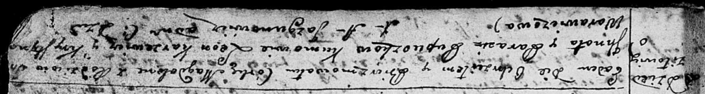

**Пупушко Магдалена Игнатова (Pupuszkowna Magdalena)**

16 января 1793 г -- крещение (НИАБ 136-13-894, лист 18, №9/1793-р
(ориг)).

**НИАБ 136-13-894:** Лист 18. **Метрическая запись №9/1793-р (ориг).**

Дедиловичская Покровская церковь. 16 января 1793 года. Метрическая
запись о крещении.

Pupuszkowna Magdalena -- дочь родителей с деревни Дедиловичи.

Pupuszko Jhnat -- отец.

Pupuszkowa Parasia -- мать.

Karżewicz Leon -- кум.

Warawiczowa Krystyna -- кума.

Jazgunowicz Antoni -- ксёндз.
