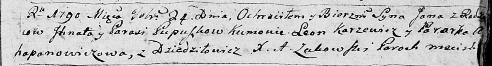

**Пупушко Паланея Игнатова (Pupuszkowna Pałanieja)**

6 октября 1795 г -- крещение (НИАБ 136-13-894, лист 25об, №41/1795-р
(ориг)), (РГИА 823-2-18, лист 253об, №33/1795-р (коп)).

**НИАБ 136-13-894:** Лист 25об. **Метрическая запись №41/1795-р
(ориг).**

{width="6.496527777777778in"
height="1.2712784339457568in"}

Дедиловичская Покровская церковь. 6 октября 1795 года. Метрическая
запись о крещении.

Pupuszkowna Pałanieja -- дочь родителей с деревни Дедиловичи.

Pupuszka Jhnat -- отец.

Pupuszkowa Parasia -- мать.

Jacuk Janka - кум.

Warawiczowa Krystyna - кума.

Jazgunowicz Antoni -- ксёндз.

**РГИА 823-2-18:** Лист 253об. **Метрическая запись №33/1795-р (коп).**

{width="6.496527777777778in"
height="1.8472222222222223in"}

Дедиловичская Покровская церковь. 6 октября 1795 года. Метрическая
запись о крещении.

Pupuszkowna Pałanieja -- дочь родителей с деревни Дедиловичи.

Pupuszka Jhnat -- отец.

Pupuszkowa Parasia -- мать.

Jacuk Janko -- кум.

Warawiczowa Krystyna -- кума.

Jazgunowicz Antoni -- ксёндз.
