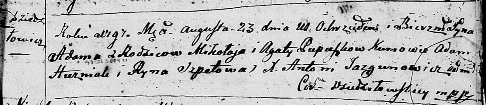
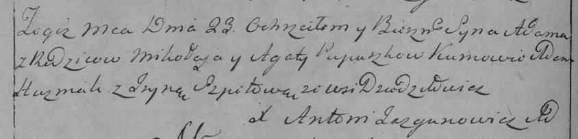

**Пупушко Адам Миколаев (Pupuszko Adam)**

23 августа 1797 г -- крещение (НИАБ 136-13-894, лист 34, №52/1797-р
(ориг)), (РГИА 823-2-18, лист 260об, №36/1797-р (коп)).

**НИАБ 136-13-894:** Лист 34. **Метрическая запись №52/1797-р (ориг).**

Дедиловичская Покровская церковь. 23 августа 1797 года. Метрическая
запись о крещении.

Pupuszka Adam -- сын родителей с деревни Дедиловичи.

Pupuszka Mikołay -- отец.

Pupuszkowa Agata -- мать.

Huzniak Adam - кум.

Szpetowa Ryna - кума.

Jazgunowicz Antoni -- ксёндз.

**РГИА 823-2-18:** Лист 260об. **Метрическая запись №36/1797-р (коп).**

Дедиловичская Покровская церковь. 23 августа 1797 года. Метрическая
запись о крещении.

Pupuszko Adam -- сын родителей с деревни Дедиловичи.

Pupuszko Mikołay -- отец.

Pupuszkowa Agata -- мать.

Huzniak Adam -- кум.

Szpetowa Jryna -- кума.

Jazgunowicz Antoni -- ксёндз.
