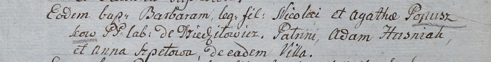

**Пупушко Барбара Миколаева (Popuszkowna Barbara)**

3 сентября 1805 г -- крещение (НИАБ 937-4-32, лист 12, №32/1805-р).

**НИАБ 937-4-32:** Лист 12. **Метрическая запись №32/1805-р.**

Дедиловичский костел Наисвятейшего Сердца Иисуса. 3 сентября 1805 года.
Метрическая запись о крещении.

Popuszkowna Barbara -- дочь крестьян с деревни Дедиловичи.

Popuszko Nicolai -- отец.

Popuszkowa Agatha -- мать.

Huzniak Adam -- крестный отец.

Szpetowa Anna -- крестная мать, с деревни Дедиловичи.

Linhart Hiacinthus -- ксёндз.
