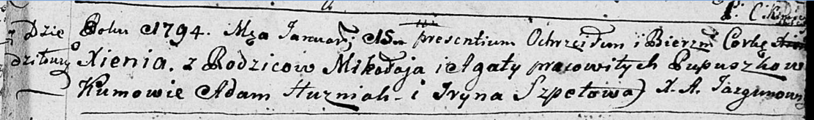

**Пупушко Ксеня Миколаева (Pupuszkowna Xienia)**

15 января 1794 г -- крещение (НИАБ 136-13-894, лист 21, №4/1794-р
(ориг)).

**НИАБ 136-13-894:** Лист 21. **Метрическая запись №4/1794-р (ориг).**

Дедиловичская Покровская церковь. 15 января 1794 года. Метрическая
запись о крещении.

Pupuszkowna Xienia -- дочь селян с деревни Дедиловичи.

Pupuszko Mikołay -- отец.

Pupuszkowa Agata-- мать.

Huszniak Adam - кум.

Szpetowa Jryna - кума.

Jazgunowicz Antoni -- ксёндз.
