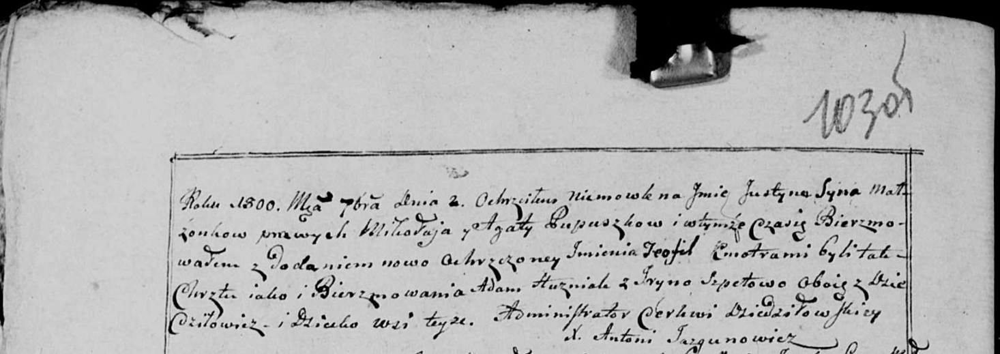

**Пупушко Юстына Миколаева (Pupuszkowna Justyna Tekla)**

2 сентября 1800 г -- крещение (НИАБ 136-13-894, лист 42, №23/1800-р
(ориг), НИАБ 136-13-949, лист 103об, №26/1800-р (коп)).

**НИАБ 136-13-894:** Лист 42. **Метрическая запись №23/1800-р (ориг).**

Дедиловичская Покровская церковь. 2 сентября 1800 года. Метрическая
запись о крещении.

Pupuszkowna Justyna Tekla -- дочь родителей с деревни Дедиловичи.

Pupuszko Mikołay -- отец.

Pupuszkowa Agata -- мать.

Huzniak Adam -- кум, с деревни Дедиловичи.

Szpetowa Jryna -- кума, с деревни Дедиловичи.

Jazgunowicz Antoni -- ксёндз.

**НИАБ 836-13-949:** Лист 103об. **Метрическая запись №26/1800-р
(коп).**

(См. тж.: НИАБ 136-13-894, лист 42, №23/1800-р (ориг))

Дедиловичская Покровская церковь. 2 сентября 1800 года. Метрическая
запись о крещении.

Pupuszka Justyn Teofil \[Justyna Tekla\] -- сын \[дочь\] родителей с
деревни Дедиловичи.

Pupuszka Mikołay -- отец.

Pupuszkowa Agata -- мать.

Huzniak Adam -- кум, с деревни Дедиловичи.

Szpetowa Jryna - кума, с деревни Дедиловичи.

Jazgunowicz Antoni -- ксёндз.
