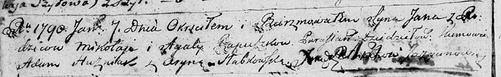
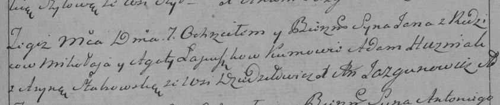

**Пупушко Ян Миколаев старший (Pupuszko Jan)**

7 января 1790 г -- крещение сына Яна старшего (НИАБ 136-13-894, лист
8об, №2/1790-р (ориг)), (РГИА 823-2-18, лист 239, №2/1790-р (коп)).

**НИАБ 136-13-894:** Лист 8об. **Метрическая запись №2/1790-р (ориг).**

Дедиловичская Покровская церковь. 7 января 1790 года. Метрическая запись
о крещении.

Pupuszko Jan -- сын.

Pupuszko Mikołaj -- отец.

Pupuszkowa Agata -- мать.

Huzniak Adam - кум.

Słabkowska Aryna - кума.

Jazgunowicz Antoni -- ксёндз.

**РГИА 839-2-18:** Лист 239. **Метрическая запись №2/1790-р (коп).**

Дедиловичская Покровская церковь. 7 января 1790 года. Метрическая запись
о крещении.

\[Pu\]puszko Jan -- сын родителей с деревни Дедиловичи.

\[Pu\]puszko Mikołay -- отец.

\[Pu\]puszkowa Agata -- мать.

Huzniak Adam -- кум.

S\[ł\]abowska Aryna - кума.

Jazgunowicz Antoni -- ксёндз.
