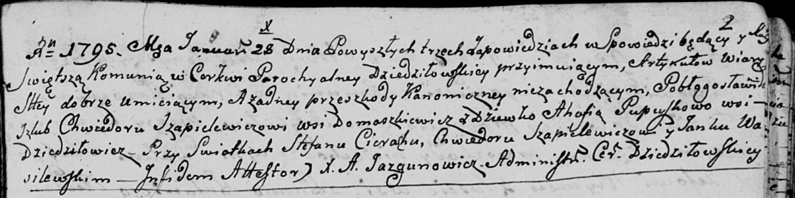

**Шапелевич (Пупушко) Агафия (Szapielewiczowa Ahafia z Pupuszkow)**

28 января 1795 г -- венчание с Хведором Шапелевичем с деревни
Домашковичи (НИАБ 136-13-920, лист 2, №2/1795-б (ориг)).

**НИАБ 136-13-920:** Лист 2. **Метрическая запись №2/1795-б (ориг).**

Дедиловичская Покровская церковь. 28 января 1795 года. Метрическая
запись о венчании.

Szapiełewicz Chwiedor -- жених, деревня Домашковичи.

Pupuszkowa Ahafia -- невеста, девка, деревня Дедиловичи.

Cierach Stefan -- свидетель.

Szapiełewicz Chwiedor -- свидетель.

Wasiłewski Janka -- свидетель.

Jazgunowicz Antoni -- ксёндз.
