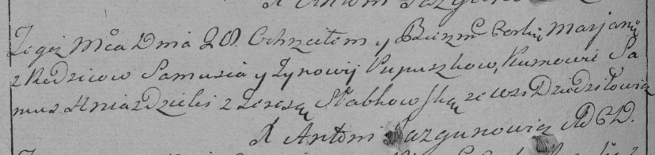

**Пупушко Марьяна Самусева (Pupuszkowna Marjana)**

7 сентября 1791 г -- крещение (НИАБ 136-13-894, лист 14, №44/1791-р
(ориг)), (РГИА 823-2-18, лист 242, №23/1791-р (коп)).

**НИАБ 136-13-894:** Лист 14. **Метрическая запись №44/1791-р (ориг).**

{width="6.496527777777778in"
height="0.9105468066491689in"}

Дедиловичская Покровская церковь. 7 сентября 1791 года. Метрическая
запись о крещении.

Pupuszkowna Marjana -- дочь родителей с деревни Дедиловичи.

Pupuszko Samuś -- отец.

Pupuszkowa Zynowija -- мать.

Hniazdzicki Samuś - кум.

Słapkowska Teressa - кума.

Jazgunowicz Antoni -- ксёндз.

**РГИА 823-2-18:** Лист 242об. **Метрическая запись №23/1791-р (коп).**

{width="6.496527777777778in"
height="1.5458333333333334in"}

Дедиловичская Покровская церковь. \[7\] сентября 1791 года. Метрическая
запись о крещении.

Pupuszkowna Marjana -- дочь родителей с деревни Дедиловичи.

Pupuszko Samuś -- отец.

Pupuszkowa Zynowija -- мать.

Hniazdzicki Samus -- кум.

Słabkowska Teresa - кума.

Jazgunowicz Antoni -- ксёндз.
