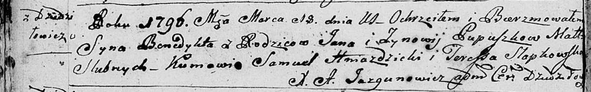

**Пупушко Ёзифат Янов (Pupuszko Jozifat)**

21 сентября 1784 г -- крещение (РГИА 823-2-18, лист 227, №18/1784-р
(коп)).

**РГИА 128-2-18:** Лист 227. **Метрическая запись №18/1784-р (коп).**

{width="6.496527777777778in"
height="2.4090277777777778in"}

Дедиловичская Покровская церковь. 21 сентября 1784 года. Метрическая
запись о крещении.

Pupuszko Jozifat -- сын родителей с деревни Дедиловичи.

Pupuszko Jan -- отец.

Pupuszkowa Zinowia -- мать.

Hniazdzicki Jan -- кум.

Bautrukowa Ewa - кума.

Jazgunowicz Antoni -- ксёндз.
