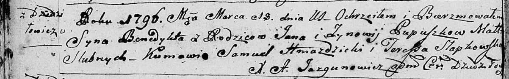

**Пупушко Бенедыкт Янов (Pupuszko Benedykt)**

18 марта 1796 г -- крещение (НИАБ 136-13-894, лист 28об, №32/1796-р
(ориг)).

**НИАБ 136-13-894:** Лист 28-об. **Метрическая запись №32/1796-р
(ориг).**

{width="6.496527777777778in"
height="1.0211800087489065in"}

Дедиловичская Покровская церковь. 18 марта 1796 года. Метрическая запись
о крещении.

Pupuszko Benedykt -- сын родителей с деревни Дедиловичи.

Pupuszko Jan -- отец.

Pupuszkowa Zynowija -- мать.

Hniazdzicki Samuel - кум.

Słapkowska Teressa - кума.

Jazgunowicz Antoni -- ксёндз.
