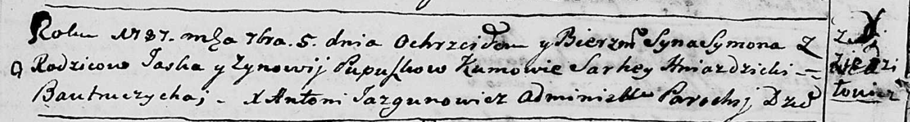
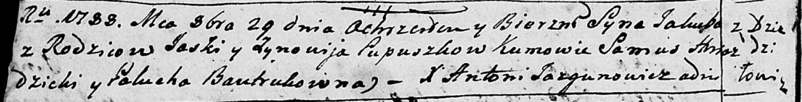
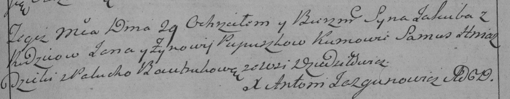

**Пупушко Зыновья (Pupuszkowa Zynowija)**

5 сентября 1787 г -- крещение сына Сымона (НИАБ 136-13-894, лист 2об,
№43/1787-р (ориг)).

29 октября 1788 г -- крещение сына Якуба (НИАБ 136-13-894, лист 5об,
№56/1788-р (ориг)), (: РГИА 823-2-18, лист 237, №29/1788-р (коп)).

**НИАБ 136-13-894:** Лист 2об. **Метрическая запись №43/1787-р (ориг).**

Дедиловичская Покровская церковь. 5 сентября 1787 года. Метрическая
запись о крещении.

Pupuszko Symon - сын родителей с деревни Дедиловичи.

Pupuszko Jaśka -- отец.

Pupuszkowa Zynowija -- мать.

Hniazdzicki Sarhey - кум.

Bautruczycha - кума.

Jazgunowicz Antoniusz -- ксёндз.

Лист 5об. **Метрическая запись №56/1788-р (ориг).**

Дедиловичская Покровская церковь. 29 октября 1788 года. Метрическая
запись о крещении.

Pupuszka Jakub -- сын родителей с деревни Дедиловичи.

Pupuszka Jaśka-- отец.

Pupuszkowa Zynowija -- мать.

Hniazdzicki Samuś - кум.

Bautrukowna Palucha - кума.

Jazgunowicz Antoni -- ксёндз.

**РГИА 823-2-18:** Лист 237. **Метрическая запись №29/1788-р (коп).**

Дедиловичская Покровская церковь. 29 октября 1788 года. Метрическая
запись о крещении.

Pupuszko Jakub -- сын родителей с деревни Дедиловичи.

Pupuszko Jan \[Jaśka\] -- отец.

Pupuszkowa Zynowija -- мать.

Hniazdzicki Samus -- кум.

Bautrukowa Palucha - кума.

Jazgunowicz Antoni -- ксёндз.
