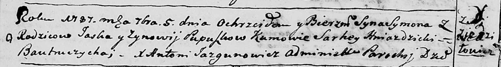

**Пупушко Сымон Яськов (Pupuszko Symon)**

5 сентября 1787 г -- крещение (НИАБ 136-13-894, лист 2об, №43/1787-р
(ориг)).

**НИАБ 136-13-894:** Лист 2об. **Метрическая запись №43/1787-р (ориг).**

{width="6.496527777777778in"
height="0.8817147856517935in"}

Дедиловичская Покровская церковь. 5 сентября 1787 года. Метрическая
запись о крещении.

Pupuszko Symon - сын родителей с деревни Дедиловичи.

Pupuszko Jaśka -- отец.

Pupuszkowa Zynowija -- мать.

Hniazdzicki Sarhey - кум.

Bautruczycha - кума.

Jazgunowicz Antoniusz -- ксёндз.
