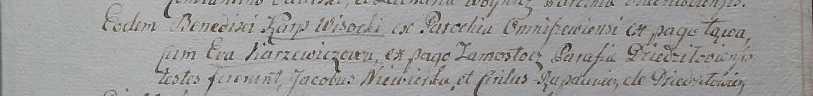
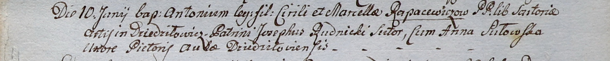
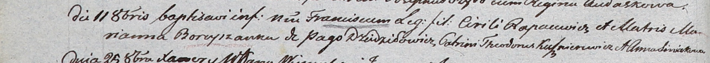
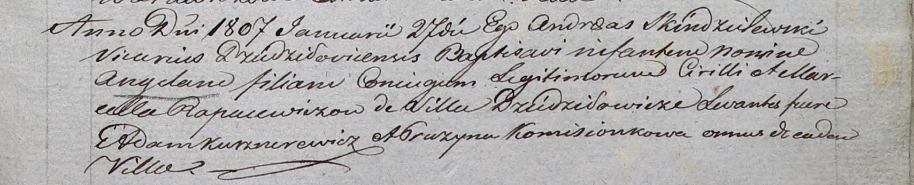
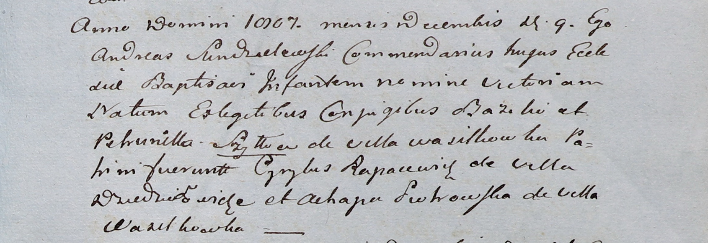

**Рапацевич Кирилл (Rapacewicz Cirilus, Cirili)**

13 октября 1799 г -- свидетель венчания Карпа Высоцкого с деревни Лонва
Омнишевской парохии с Евой Каржевич с деревни Замосточье (НИАБ
1781-27-199, лист 130, №11/1799-б).

10 июня 1800 г -- крещение сына Антона (НИАБ 937-4-32, лист 2,
№19/1800-р).

11 октября 1803 г -- крещение сына Франциска (НИАБ 937-4-32, лист 9об,
№25/1803-р).

27 января 1807 г -- крещение дочери Ангели (НИАБ 937-4-32, лист 14,
№2/1807-р).

9 декабря 1807 г -- крестный отец Виктории, дочери Василя и Петрунели
Шил с деревни Васильковка (НИАБ 937-4-32, лист 17, №24/1807-р).

**НИАБ 1781-27-199:** Лист 130. **Метрическая запись №11/1799-б.**

Дедиловичский костел Наисвятейшего Сердца Иисуса. 13 октября 1799 года.
Метрическая запись о венчании.

Wisocki Karp -- жених, с парохии Омнишевской, с деревни Лонва.

Karzewiczowa Ewa -- невеста, с деревни Замосточье, парохии
Дедиловичской.

Niewerka Jakob -- свидетель.

Rapacewicz Cirilus -- свидетель, с деревни Дедиловичи.

Linhart Hyacinthus -- ксёндз.

**НИАБ 937-4-32:** Лист 2. **Метрическая запись №19/1800-р.**

Дедиловичский костел Наисвятейшего Сердца Иисуса. 10 июня 1800 года.
Метрическая запись о крещении.

Rapacewicz Antoni -- сын крестьян с деревни Дедиловичи.

Rapacewicz Cirili -- отец.

Rapacewiczowa Marcella -- мать.

Rudnicki Joseph -- крестный отец, с деревни Дедиловичи.

Sutowska Anna -- крестная мать, с деревни Дедиловичи.

Linhart Hyacinthus -- ксёндз.

**НИАБ 937-4-32:** Лист 9об. **Метрическая запись №25/1803-р.**

Дедиловичский костел Наисвятейшего Сердца Иисуса. 11 октября 1803 года.
Метрическая запись о крещении.

Rapacewicz Francisc -- сын родителей с деревни Дедиловичи.

Rapacewicz Cirili -- отец.

Rapacewiczowa Marianna z Boreyszow -- мать.

Kusznierewicz Theodor -- крестный отец.

Siniakowna Anna -- крестная мать.

Kłoczko Antoni -- ксёндз, администратор Ошмянского костела.

**НИАБ 937-4-32:** Лист 14. **Метрическая запись №2/1807-р.**

Дедиловичский костел Наисвятейшего Сердца Иисуса. 27 января 1807 года.
Метрическая запись о крещении.

Rapacewiczowna Angela -- дочь родителей с деревни Дедиловичи.

Rapacewicz Cirilli -- отец.

Rapacewiczowa Marcella -- мать.

Kusznierewicz Adam -- крестный отец, с деревни Дедиловичи.

Komisionkowa Pruzyna -- крестная мать, с деревни Дедиловичи.

Skindzelewski Andreas -- ксёндз, викарий Дедиловичский.

**НИАБ 937-4-32:** Лист 17. **Метрическая запись №24/1807-р.**

Дедиловичский костел Наисвятейшего Сердца Иисуса. 9 декабря 1807 года.
Метрическая запись о крещении.

Szyłłowna Victoria -- дочь родителей с деревни Васильковка.

Szyłło Bazili -- отец.

Szyłłowa Petrunella -- мать.

Rapacewicz Cyrylus -- крестный отец, с деревни Дедиловичи.

Piоtrowska Ahapa -- крестная мать, с деревни Васильковка.

Scindzelewski Andreas -- ксёндз, викарий Дедиловичский.
