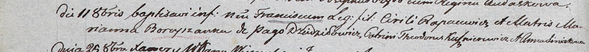

**Рапацевич Франциск Кириллов (Rapacewicz Francisc)**

11 октября 1803 г -- крещение (НИАБ 937-4-32, лист 9об, №25/1803-р).

**НИАБ 937-4-32:** Лист 9об. **Метрическая запись №25/1803-р.**

Дедиловичский костел Наисвятейшего Сердца Иисуса. 11 октября 1803 года.
Метрическая запись о крещении.

Rapacewicz Francisc -- сын родителей с деревни Дедиловичи.

Rapacewicz Cirili -- отец.

Rapacewiczowa Marianna z Boreyszow -- мать.

Kusznierewicz Theodor -- крестный отец.

Siniakowna Anna -- крестная мать.

Kłoczko Antoni -- ксёндз, администратор Ошмянского костела.
