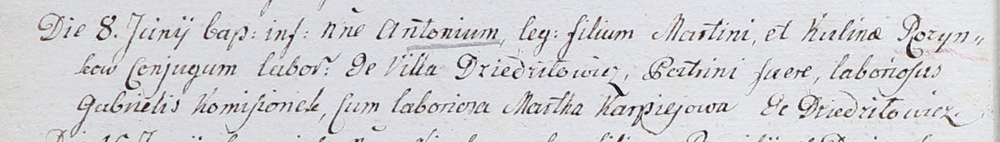

**Розынко Кулина (Rozynkowa Kulina)**

8 июня 1802 г -- крещение сына Антона (НИАБ 937-4-32, лист 6об,
№13/1802-р).

3 апреля 1804 г -- крещение дочери Франциски (НИАБ 937-4-32, лист 10,
№5/1804-р).

13 ноября 1805 г -- крестная мать Розалии, дочери вольных людей
Александра и Грипины Дедил с поселения Висильки (НИАБ 937-4-32, лист
12об, №41/1805-р).

29 июня 1809 г -- крестная мать Петронели, дочери Яна и Марьяны Борейшов
с деревни Дедиловичи (НИАБ 937-4-32, лист 19об, №19/1809-р).

**НИАБ 937-4-32:** Лист 6об. **Метрическая запись №13/1802-р.**

Дедиловичский костел Наисвятейшего Сердца Иисуса. 8 июня 1802 года.
Метрическая запись о крещении.

Rozynko Antoni -- сын крестьян с деревни Дедиловичи.

Rozynko Martin -- отец.

Rozynkowa Kulina -- мать.

Komisionek Gabriel -- крестный отец, крестьянин, с деревни Дедиловичи.

Karpiejowa Martha -- крестная мать, крестьянка, с деревни Дедиловичи.

Linhart Hyacinthus -- ксёндз.

**НИАБ 937-4-32:** Лист 10. **Метрическая запись №5/1804-р.**

Дедиловичский костел Наисвятейшего Сердца Иисуса. 3 апреля 1804 года.
Метрическая запись о крещении.

Rozynkowna Francisca -- дочь крестьян с деревни Дедиловичи.

Rozynko Martin -- отец.

Rozynkowa Culina -- мать.

Kamisionek Hauryło -- крестный отец.

Warawiczowa Marta -- крестная мать.

Galinowski Joann -- ксёндз, комендант Дедиловичского костела.

**НИАБ 937-4-32:** Лист 12об. **Метрическая запись №41/1805-р.**

Дедиловичский костел Наисвятейшего Сердца Иисуса. 13 ноября 1805 года.
Метрическая запись о крещении.

Dziedziłowna Rosalia -- дочь вольных людей с деревни? Висильки.

Dziedziło Alexander -- отец.

Dziedziłowa Hripina -- мать.

Szyło Chwiedor -- крестный отец.

Rozinkowa Culina -- крестная мать, с деревни Дедиловичи.

Linhart Hiacinthus -- ксёндз.

29 июня 1809 г -- крещение (НИАБ 937-4-32, лист 19об, №19/1809-р).

**НИАБ 937-4-32:** Лист 19об. **Метрическая запись №19/1809-р.**

Дедиловичский костел Наисвятейшего Сердца Иисуса. 29 июня 1809 года.
Метрическая запись о крещении.

Berczyszowa Petronella -- дочь крестьян с деревни Дедиловичи.

Berczysz Joann -- отец.

Berczyszowa Marianna -- мать.

Szlagrowski Thomas -- крестный отец, с деревни Дедиловичи.

Rozynkowa Kulina -- крестная мать, с деревни Дедиловичи.

Miszkun Marcus -- ксёндз.
