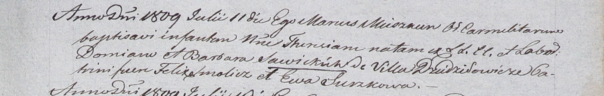

**Савицкая Барбара (Sawicka Barbara)**

21 ноября 1804 г -- крестная мать Марьяны, дочери Иосифа и Катарины Шил
с деревни Дедиловичи (НИАБ 937-4-32, лист 10об, №23/1804-р).

2 сентября 1806 г -- крещение дочери Анны (НИАБ 937-4-32, лист 13об,
№15/1806-р).

25 мая 1808 г -- крестная мать Антона, сына Яхима и Фрузыны Левицких с
деревни Дедиловичи (НИАБ 937-4-32, лист 18об, №15/1808-р).

11 июля 1809 г -- крещение дочери Терезы (НИАБ 937-4-32, лист 20,
№21/1809-р).

10 июня 1812 г -- крещение дочери Марии (НИАБ 937-4-32, лист 24об,
№14/1812-р).

**НИАБ 937-4-32:** Лист 10об. **Метрическая запись №23/1804-р.**

Дедиловичский костел Наисвятейшего Сердца Иисуса. 21 ноября 1804 года.
Метрическая запись о крещении.

Szyłowna Marianna -- дочь крестьян с деревни Дедиловичи.

Szyło Joseph -- отец.

Szyłowa Catharina -- мать.

Wasilewski Stephan -- крестный отец, с деревни Дедиловичи.

Sawicka Barbara -- крестная мать, с деревни Дедиловичи.

Galinowski Joann -- ксёндз, комендант Дедиловичского костела.

**НИАБ 937-4-32:** Лист 13об. **Метрическая запись №15/1806-р.**

Дедиловичский костел Наисвятейшего Сердца Иисуса. 2 сентября 1806 года.
Метрическая запись о крещении.

Sawicka Anna -- дочь родителей с деревни Дедиловичи.

Sawicki Dziemian -- отец.

Sawicka Barbara -- мать.

Smolicz Felix -- крестный отец.

Suszkowa Hapa -- крестная мать.

Skindzelewski Andreas -- ксёндз, комендант Дедиловичский.

**НИАБ 937-4-32:** Лист 18об. **Метрическая запись №15/1808-р.**

Дедиловичский костел Наисвятейшего Сердца Иисуса. 25 мая 1808 года.
Метрическая запись о крещении.

Lewicki Antoni -- сын родителей с деревни Дедиловичи.

Lewiczki Joachim -- отец.

Lewiczka Fruzyna -- мать.

Kamisionek Gabriel -- крестный отец, с деревни Дедиловичи.

Sawicka Barbara -- крестная мать, с деревни Дедиловичи.

Scindzelewski Andreas -- ксёндз, комендант Дедиловичский.

**НИАБ 937-4-32:** Лист 20. **Метрическая запись №21/1809-р.**

Дедиловичский костел Наисвятейшего Сердца Иисуса. 11 июля 1809 года.
Метрическая запись о крещении.

Sawicka Theresia -- дочь крестьян с деревни Дедиловичи.

Sawicki Domian -- отец.

Sawicka Barbara -- мать.

Smolicz Felix -- крестный отец.

Surzkowa Ewa -- крестная мать.

Miszkun Marcus -- ксёндз.

**НИАБ 937-4-32:** Лист 24об. **Метрическая запись №14/1812-р.**

Дедиловичский костел Наисвятейшего Сердца Иисуса. 10 июня 1812 года.
Метрическая запись о крещении.

Sawicka Maria -- дочь крестьян с деревни Дедиловичи.

Sawicki Demian -- отец.

Sawicka Barbara -- мать.

Smolicz Jolia? -- крестный отец, с деревни Веретей.

Surzkowa Eva -- крестная мать, с деревни Веретей.

Zychowski Gabriel -- ксёндз.
