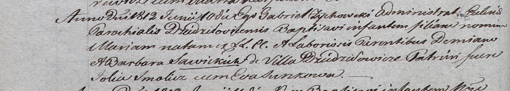

**Савицкая Мария Демьянова (Sawicka Maria)**

10 июня 1812 г -- крещение (НИАБ 937-4-32, лист 24об, №14/1812-р).

**НИАБ 937-4-32:** Лист 24об. **Метрическая запись №14/1812-р.**

Дедиловичский костел Наисвятейшего Сердца Иисуса. 10 июня 1812 года.
Метрическая запись о крещении.

Sawicka Maria -- дочь крестьян с деревни Дедиловичи.

Sawicki Demian -- отец.

Sawicka Barbara -- мать.

Smolicz Jolia -- крестный отец, с деревни Веретей.

Surzkowa Eva -- крестная мать, с деревни Веретей.

Zychowski Gabriel -- ксёндз.
