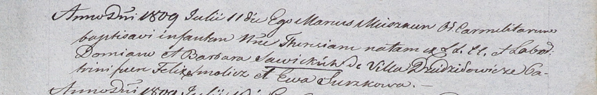

**Савицкая Тереза Демьянова (Sawicka Theresia)**

11 июля 1809 г -- крещение (НИАБ 937-4-32, лист 20, №21/1809-р).

**НИАБ 937-4-32:** Лист 20. **Метрическая запись №21/1809-р.**

{width="6.496527777777778in"
height="1.0381944444444444in"}

Дедиловичский костел Наисвятейшего Сердца Иисуса. 11 июля 1809 года.
Метрическая запись о крещении.

Sawicka Theresia -- дочь крестьян с деревни Дедиловичи.

Sawicki Domian -- отец.

Sawicka Barbara -- мать.

Smolicz Felix -- крестный отец.

Surzkowa Ewa -- крестная мать.

Miszkun Marcus -- ксёндз.
