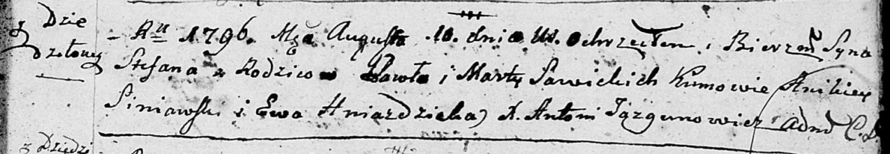

**Савицкая Агата Павлова (Sawicka Agatha)**

Январь 1801 -- крещение (НИАБ 937-4-32, лист 4, №2/1800-р).

**НИАБ 937-4-32:** Лист 4. **Метрическая запись №2/1801-р.**

{width="6.496527777777778in"
height="0.8277777777777777in"}

Дедиловичский костел Наисвятейшего Сердца Иисуса. Января 1801 года.
Метрическая запись о крещении.

Sawicka Agatha -- дочь крестьян с деревни Дедиловичи.

Sawicki Paul -- отец.

Sawicka Martha -- мать.

Szumski Michał -- крестный отец, с деревни Дедиловичи.

Hniezdzicka Ewa -- крестная мать, с деревни Дедиловичи.

Linhart Hyacinthus -- ксёндз.
