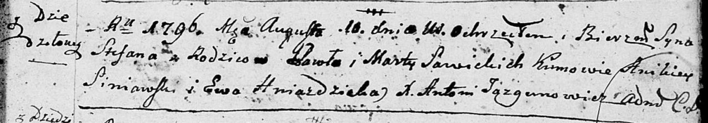

**Савицкая Магдалена Павлова (Sawicka Magdalena)**

20 ноября 1802 г -- крещение (НИАБ 937-4-32, лист 7об, №38/1802-р).

**НИАБ 937-4-32:** Лист 7об. **Метрическая запись №38/1802-р.**

{width="6.496527777777778in"
height="0.9916666666666667in"}

Дедиловичский костел Наисвятейшего Сердца Иисуса. 20 ноября 1802 года.
Метрическая запись о крещении.

Sawicka Magdalena -- дочь крестьян с местечка Дедиловичи.

Sawicki Paul -- отец.

Sawicka Martha -- мать.

Habrowski Alexey -- крестный отец, крестьянин.

Gniazdicka Eva -- крестная мать, с деревни Дедиловичи.

Linhart Hyacinthus -- ксёндз.
