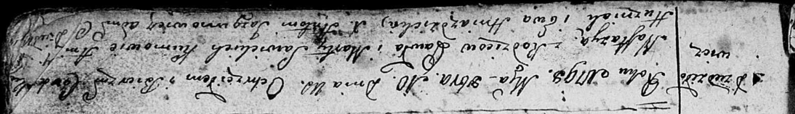
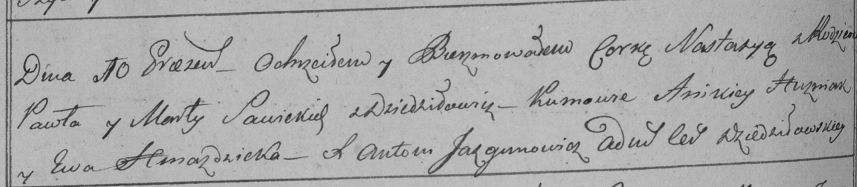

**Савицкая Настасья Павлова (Sawicka Nastazya)**

10 октября 1798 г -- крещение (НИАБ 136-13-894, лист 37, №52/1798-р
(коп)), (РГИА 823-2-18, лист 266об, №53/1798-р (коп)).

**НИАБ 136-13-894:** Лист 37. **Метрическая запись №52/1798-р (ориг).**

Дедиловичская Покровская церковь. 10 октября 1798 года. Метрическая
запись о крещении.

Sawicka Nastazya -- дочь родителей с деревни Дедиловичи.

Sawicki Paweł -- отец.

Sawicka Marta -- мать.

Huzniak Ani\[kiey\] - кум.

Hniazdzicka Ewa - кума.

Jazgunowicz Antoni -- ксёндз.

**РГИА 823-2-18:** Лист 266об. **Метрическая запись №53/1798-р (коп).**

Дедиловичская Покровская церковь. 10 октября 1798 года. Метрическая
запись о крещении.

Sawicka Nastazya -- дочь родителей с деревни Дедиловичи.

Sawicki Paweł -- отец.

Sawicka Marta -- мать.

Huzniak Anikiey -- кум.

Hniazdzicka Ewa -- кума.

Jazgunowicz Antoni -- ксёндз.
