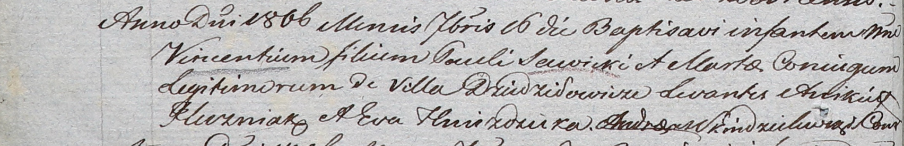

**Савицкий Винцентий Павлов (Sawicki Vincenti)**

16 сентября 1806 г -- крещение (НИАБ 937-4-32, лист 13об, №17/1806-р).

**НИАБ 937-4-32:** Лист 13об. **Метрическая запись №17/1806-р.**

Дедиловичский костел Наисвятейшего Сердца Иисуса. 16 сентября 1806 года.
Метрическая запись о крещении.

Sawicki Vincenti -- сын родителей с деревни Дедиловичи.

Sawicki Paul -- отец.

Sawicka Marta -- мать.

Huzniak Anikiey -- крестный отец.

Hniezdzicka Eva -- крестная мать.

Skindzelewski Andreas -- ксёндз, комендант Дедиловичский.
