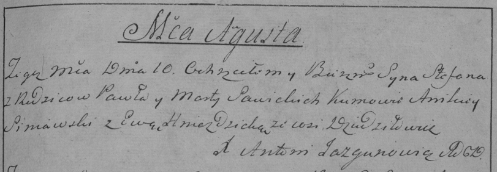

**Савицкий Степан Павлов (Sawicki Stefan)**

10 августа 1796 г -- крещение (НИАБ 136-13-894, лист 30, №71/1796-р
(коп)), (РГИА 823-2-18, лист 257, №41/1796-р (коп)).

**НИАБ 136-13-894:** Лист 30. **Метрическая запись №71/1796-р (ориг).**

{width="6.496527777777778in"
height="1.1311428258967628in"}

Дедиловичская Покровская церковь. 10 августа 1796 года. Метрическая
запись о крещении.

Sawicki Stefan -- сын родителей с деревни Дедиловичи.

Sawicki Paweł -- отец.

Sawicka Marta -- мать.

Siniawski Anikiey - кум.

Hniazdzicka Ewa - кума.

Jazgunowicz Antoni -- ксёндз.

**РГИА 823-2-18:** Лист 257. **Метрическая запись №41/1796-р (коп).**

{width="6.496527777777778in"
height="2.259027777777778in"}

Дедиловичская Покровская церковь. 10 августа 1796 года. Метрическая
запись о крещении.

Sawicki Stefan -- сын родителей с деревни Дедиловичи.

Sawicki Paweł -- отец.

Sawicka Marta -- мать.

Siniawski Anikiey -- кум.

Hniazdzicka Ewa -- кума.

Jazgunowicz Antoni -- ксёндз.
