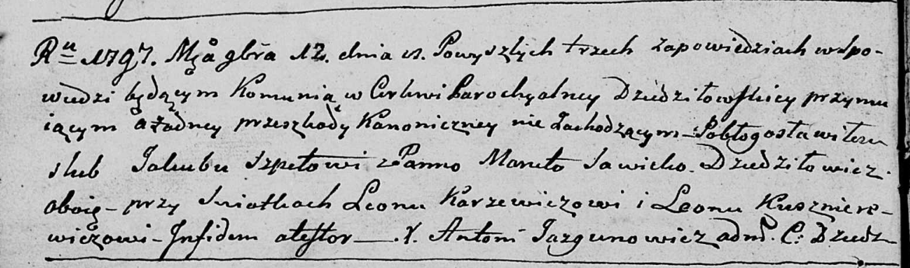

**Шпет (Савицкая) Марута (Szpetowa (Sawicka) Maruta)**

12 ноября 1797 г -- венчание с Якубом Шпетом с деревни Дедиловичи (НИАБ
136-13-920, лист 4об, №10/1797-б (ориг)).

**НИАБ 136-13-920:** Лист 4об. **Метрическая запись №10/1797-б (ориг).**

{width="6.496527777777778in"
height="1.918986220472441in"}

Дедиловичская Покровская церковь. 12 ноября 1797 года. Метрическая
запись о венчании.

Szpet Jakub -- жених, с деревни Дедиловичи.

Sawicka Maruta -- невеста, с деревни Дедиловичи.

Karżewicz Leon -- свидетель.

Kusznierewicz Leon -- свидетель.

Jazgunowicz Antoni -- ксёндз.
