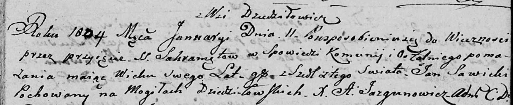

**Савицкий Ян (Sawicki Jan)**

11 января 1804 г -- отпевание, умер в возрасте 95 лет (родился около
1709 г) (НИАБ 136-13-919, лист 15, №1/1804-у (коп)).

**НИАБ 136-13-919:** Лист 15. **Метрическая запись №1/1804-у (ориг).**

Дедиловичская Покровская церковь. 11 января 1804 года. Метрическая
запись об отпевании.

Sawicki Jan -- умерший, 95 лет, с деревни Дедиловичи, похоронен на
кладбище деревни Дедиловичи.

Jazgunowicz Antoni -- ксёндз.
