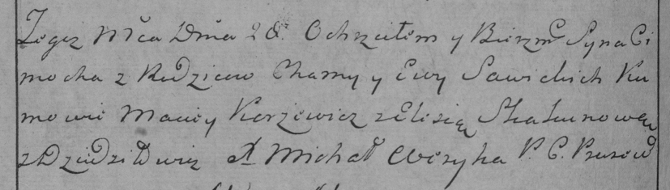

**Савицкая Ева (Sawicka Eva)**

29 января 1783 г -- крещение сына Леона (РГИА 823-2-18, лист 223об,
№3/1783-р (коп)).

28 февраля 1785 г -- крещение сына Цимоха (РГИА 823-2-18, лист 228об,
№7/1785-р (коп)).

**РГИА 823-2-18:** Лист 223об. **Метрическая запись №3/1783-р (коп).**

{width="6.496527777777778in"
height="1.8041666666666667in"}

Дедиловичская Покровская церковь. 29 января 1783 года. Метрическая
запись о крещении.

Sawicki Leon -- сын родителей с деревни Дедиловичи.

Sawicki Choma -- отец.

Sawicka Ewa -- мать.

Kuszniarewicz Jan -- кум.

Burłakowa Elena - кума.

Jazgunowicz Antoni -- ксёндз.

**РГИА 823-2-18:** Лист 228об. **Метрическая запись №7/1785-р (коп).**

{width="6.496527777777778in"
height="1.8458333333333334in"}

Дедиловичская Покровская церковь. 28 февраля 1785 года. Метрическая
запись о крещении.

Sawicki Cimoch -- сын родителей с деревни Дедиловичи.

Sawicki Chama -- отец.

Sawicka Ewa -- мать.

Karżewicz Maciey -- кум.

Skakunowa Elesia - кума.

Weryha Michal -- ксёндз Прусевичской церкви.
