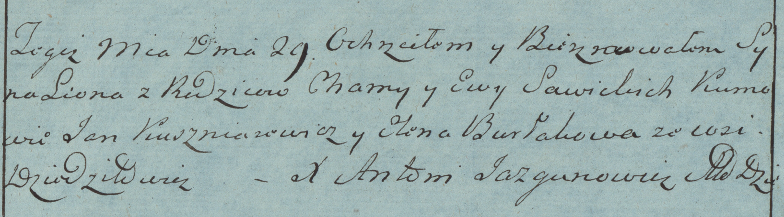

**Савицкий Леон Хомов (Sawicki Leon)**

29 января 1783 г -- крещение (РГИА 823-2-18, лист 223об, №3/1783-р
(коп)).

**РГИА 823-2-18:** Лист 223об. **Метрическая запись №3/1783-р (коп).**

Дедиловичская Покровская церковь. 29 января 1783 года. Метрическая
запись о крещении.

Sawicki Leon -- сын родителей с деревни Дедиловичи.

Sawicki Choma -- отец.

Sawicka Ewa -- мать.

Kuszniarewicz Jan -- кум. \[не идентифицирован\]

Burłakowa Elena - кума.

Jazgunowicz Antoni -- ксёндз.
