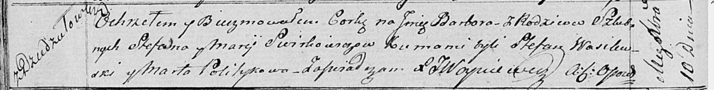

**Сверкович, Свиркович Степан (Swierkowicz, Swirkowicz Sciepan,
Stefan)**

12 ноября 1805 г -- венчание с Марысей Ставр (НИАБ 136-13-920, лист
11об, №7/1805-б (ориг)).

14 ноября 1808 г -- крещение сына Филипа (НИАБ 136-13-894, лист 73,
№43/1808-р (ориг)).

10 декабря 1817 г -- крещение дочери Варвары (НИАБ 136-13-894, лист
97об, №65/1817-р (ориг)).

**НИАБ 136-13-920:** Лист 11об. **Метрическая запись №7/1805-б (ориг).**

{width="6.496527777777778in"
height="1.3296128608923885in"}

Дедиловичская Покровская церковь. 12 ноября 1805 года. Метрическая
запись о венчании.

Swirkowicz Stefan -- жених, с деревни \[Дедиловичи\].

Staurowna Marysia -- невеста.

Juchnowiec Prokop -- свидетель.

Smolicz Felicyan -- свидетель.

Jazgunowicz Antoni -- ксёндз.

**НИАБ 136-13-894:** Лист 73. **Метрическая запись №43/1808-р (ориг).**

{width="6.496527777777778in"
height="0.9219455380577428in"}

Дедиловичская Покровская церковь. 14 ноября 1808 года. Метрическая
запись о крещении.

Swierkowicz Filip -- сын родителей с деревни Дедиловичи.

Swierkowicz Sciepan -- отец.

Swierkowiczowa Marya -- мать.

Jacuk Jozef -- кум.

Politykowa Maruta -- кума.

Jazgunowicz Antoni -- ксёндз.

**НИАБ 136-13-894:** Лист 97об. **Метрическая запись №65/1817-р
(ориг).**

{width="6.496527777777778in"
height="0.8253926071741032in"}

Осовская Покровская церковь. 10 декабря 1817 года. Метрическая запись о
крещении.

Swirkowiczowna Barbara -- дочь родителей с деревни Дедиловичи.

Swirkowicz Stefan -- отец.

Swirkowiczowa Marija -- мать.

Wasilewski Stefan -- кум.

Politykowa Marta -- кума.

Woyniewicz Tomasz -- ксёндз.
