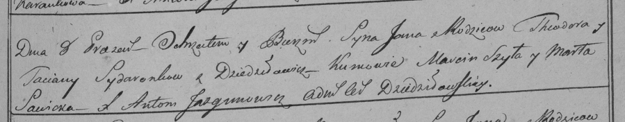

**Сидор Тодора (Sidorowa Todora)**

8 июня 1798 г -- крещение сына Яна (НИАБ 136-13-894, лист 36, №24/1798-р
(ориг)), (РГИА 823-2-18, лист 264, №24/1798-р (коп)).

**НИАБ 136-13-894:** Лист 36. **Метрическая запись №24/1798-р (ориг).**

{width="6.496527777777778in"
height="0.9206036745406824in"}

Дедиловичская Покровская церковь. 8 июня 1798 года. Метрическая запись о
крещении.

Sydor Jan -- сын родителей с деревни Дедиловичи.

Sydor Todor -- отец.

Sydorowa Todora -- мать.

Szyło Marcin - кум.

Sawicka Marta - кума.

Jazgunowicz Antoni -- ксёндз.

**РГИА 823-2-18:** Лист 264. **Метрическая запись №24/1798-р (коп).**

{width="6.496527777777778in"
height="1.2715277777777778in"}

Дедиловичская Покровская церковь. 8 июня 1798 года. Метрическая запись о
крещении.

Sydaronek Jan -- сын родителей с деревни Дедиловичи.

Sydaronek Theodor -- отец.

Sydaronkowa Tacianna -- мать.

Szyła Marcin -- кум.

Sawicka Marta -- кума.

Jazgunowicz Antoni -- ксёндз.
