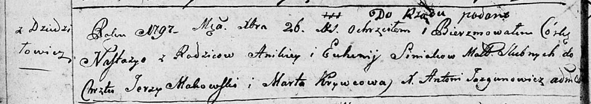
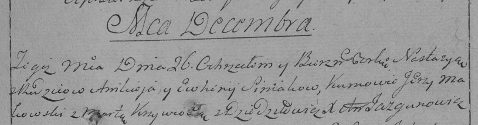

**Синяк Настасья Аникеева (Siniakowna Nastazyia)**

26 декабря 1796 г -- крещение (НИАБ 136-13-894, лист 31об, №98/1796-р
(ориг)), (РГИА 823-2-18, лист 258, №61/1796-р (коп)).

**НИАБ 136-13-894:** Лист 31-об. **Метрическая запись №98/1796-р
(ориг).**

Дедиловичская Покровская церковь. 26 декабря 1796 года. Метрическая
запись о крещении.

Siniakowna Nastazyia -- дочь родителей с деревни Дедиловичи.

Siniak Anikiey -- отец.

Siniakowa Euhenija -- мать.

Makowski Jerzy - кум.

Krywcowa Marta - кума.

Jazgunowicz Antoni -- ксёндз.

**РГИА 823-2-18:** Лист 258. **Метрическая запись №61/1796-р (коп).**

Дедиловичская Покровская церковь. 26 декабря 1796 года. Метрическая
запись о крещении.

Siniakowna Nastazya -- дочь родителей с деревни Дедиловичи.

Siniak Anikiey -- отец.

Siniakowa Ewhenija -- мать.

Makowski Jerzy -- кум.

Krywcowa Marta -- кума.

Jazgunowicz Antoni -- ксёндз.
