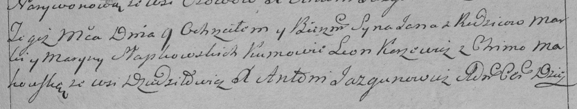

**Синяк (Слабковская) Марына (Słabkowska Maryna z Siniakow)**

8 ноября 1792 г -- венчание с Маркой Слабковским с деревни Дедиловичи
(НИАБ 136-13-894, лист 71об, №18/1792-б (ориг)).

9 октября 1793г -- крещение сына Яна (НИАБ 136-13-894, лист 20,
№70/1793-р (ориг)), (РГИА 823-2-18, лист 248, №38/1793-р (коп)).

24 июня 1798 г -- крещение дочери Юстыны (НИАБ 136-13-894, лист 36,
№27/1798-р (ориг)), (РГИА 823-2-18, лист 264об, №27/1798-р (коп)).

**НИАБ 136-13-894:** Лист 71об. **Метрическая запись №18/1792-б
(ориг).**

{width="6.496527777777778in"
height="1.6487729658792651in"}

Дедиловичская Покровская церковь. 8 ноября 1792 года. Метрическая запись
о венчании.

Słabkowski Marka -- жених, с деревни Дедиловичи.

Siniakowna Maryna -- невеста, с деревни Дедиловичи.

Jsaj Samuś -- свидетель.

Huzniak Roman -- свидетель, с деревни Дедиловичи.

Jazgunowicz Antoni -- ксёндз.

**НИАБ 136-13-894:** Лист 20-об. **Метрическая запись №70/1793-р
(ориг).**

{width="6.496527777777778in"
height="0.7516371391076115in"}

Дедиловичская Покровская церковь. 9 октября 1793 года. Метрическая
запись о крещении.

Słapkowski Jan -- сын родителей с деревни Дедиловичи.

Słapkowski Marko -- отец.

Słapkowska Maryna-- мать.

Karżewicz Leon - кум.

Makowska Chima - кума.

Jazgunowicz Antoni -- ксёндз.

**РГИА 823-2-18:** Лист 248. **Метрическая запись №38/1793-р (коп).**

{width="6.496527777777778in"
height="1.2319444444444445in"}

Дедиловичская Покровская церковь. 9 октября 1793 года. Метрическая
запись о крещении.

Słapkowski Jan -- сын родителей с деревни Дедиловичи.

Słapkowski Marko -- отец.

Słapkowska Maryna -- мать.

Karżewicz Leon -- кум.

Makowska Chima -- кума.

Jazgunowicz Antoni -- ксёндз.

**НИАБ 136-13-894:** Лист 36. **Метрическая запись №27/1798-р (ориг).**

{width="6.496527777777778in"
height="0.7811384514435695in"}

Дедиловичская Покровская церковь. 24 июня 1798 года. Метрическая запись
о крещении.

Słapkowska Justyna -- дочь родителей с деревни Дедиловичи.

Słapkowski Marko -- отец.

Słapkowska Maryna -- мать.

Karżewicz Leon - кум.

Makowska Chima - кума.

Jazgunowicz Antoni -- ксёндз.

**РГИА 823-2-18:** Лист 264об. **Метрическая запись №27/1798-р (коп).**

{width="6.496527777777778in"
height="1.4145833333333333in"}

Дедиловичская Покровская церковь. 24 июня 1798 года. Метрическая запись
о крещении.

Słapkowska Justyna -- дочь родителей с деревни Дедиловичи.

Słapkowski Marko -- отец.

Słapkowska Maryna -- мать.

Korżewicz Leon -- кум.

Makowska Chima -- кума.

Jazgunowicz Antoni -- ксёндз.
